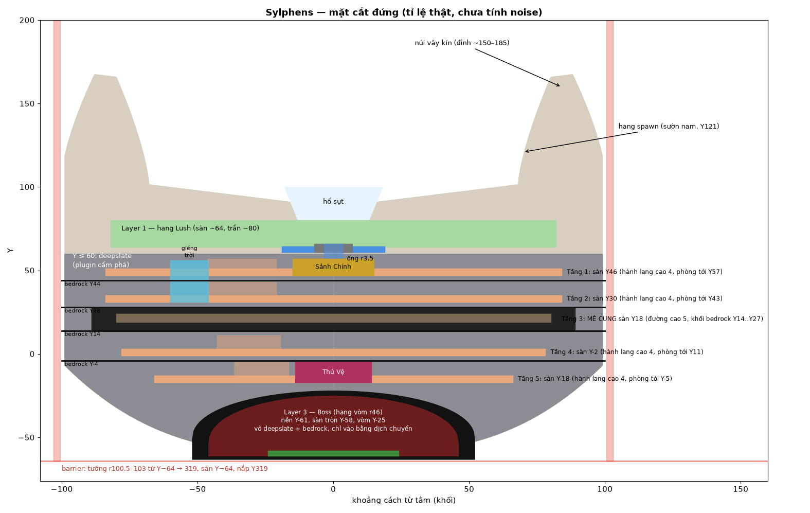
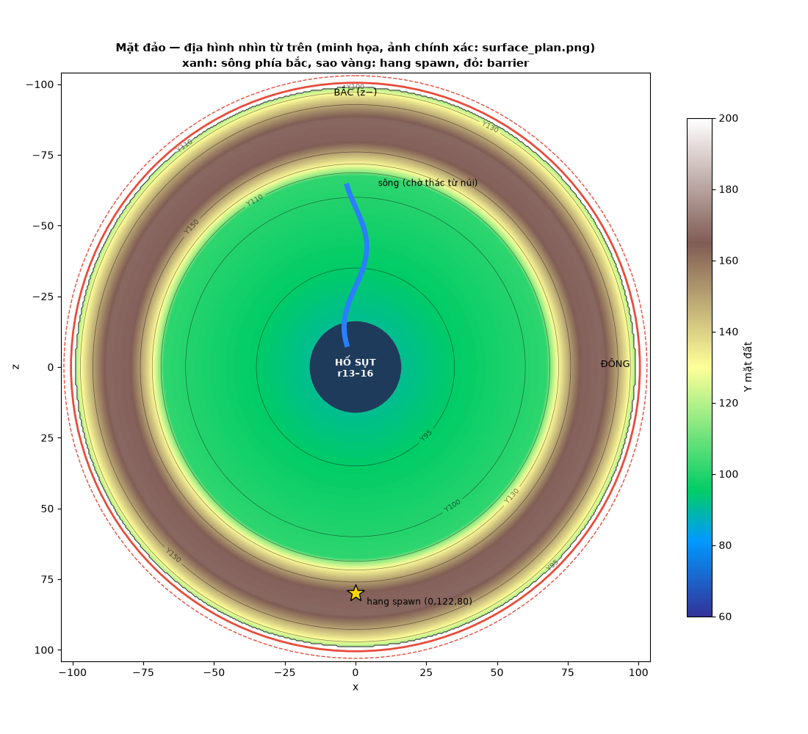
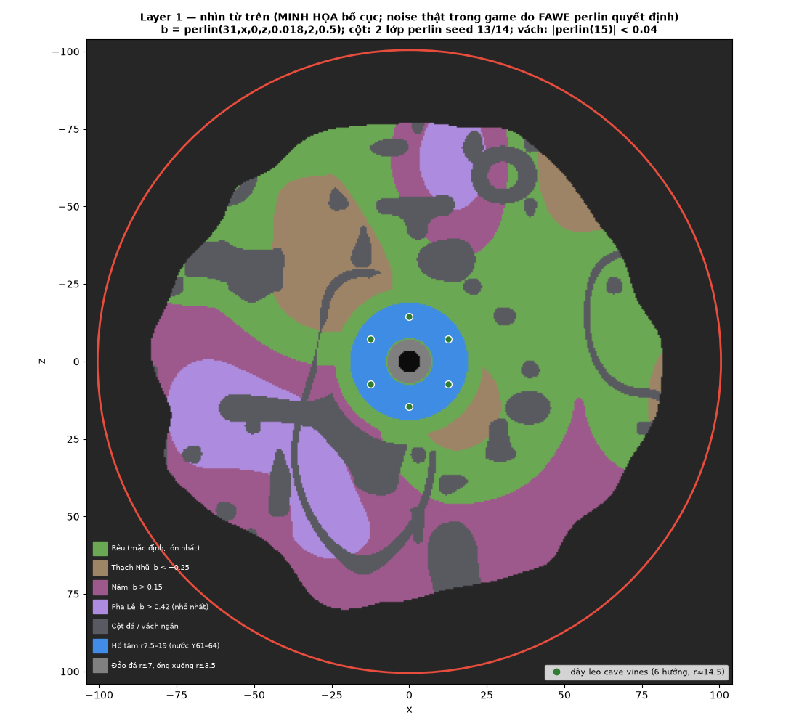
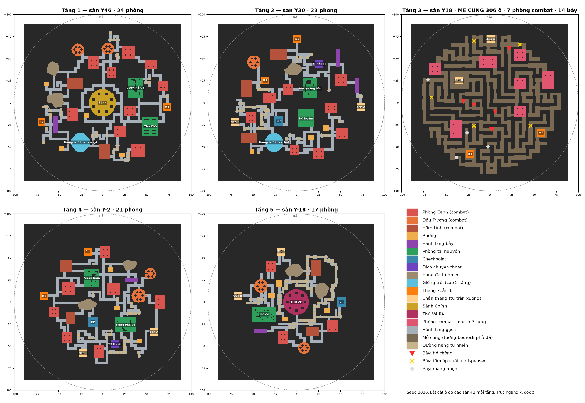

# Sylphens — dungeon đảo nổi (tên cũ: Root Island / Đảo Rễ Cây Thế Giới v2)

Dungeon đảo nổi cho server Minecraft RPG **When the Dungeon Arise**. Dựng bằng FAWE (lệnh chat `//g -r`) và một file schematic sinh thủ tục cho Layer 2.



## Tóm tắt
| Phần | Mô tả | Y |
|---|---|---|
| Barrier | tường tròn r100.5–103, sàn, nắp | −64 → 319 |
| Mặt đảo | thung lũng lõm về tâm, núi dốc vây kín, rừng thông, hang spawn ở sườn nam + đường gấp khúc, sông bắc chảy vào hố sụt | ~92–185 |
| Layer 1 | hang Lush, cột đá, vách ngăn, biome Rêu/Thạch Nhũ/Nấm/Pha Lê, hồ tâm | ~64–80 |
| Layer 2 | 5 tầng sinh theo seed: 4 tầng phòng (hành lang có đuốc, vòm cửa, giếng trời) + **tầng 3 là mê cung lớn bọc bedrock** (phòng combat, bẫy) | sàn 46/30/18/−2/−18 |
| Bedrock ngăn tầng | 4 tấm, chỉ hở ở thang và giếng trời | 44/28/14/−4 |
| Layer 3 | phòng boss hang vòm r46: sàn tròn có vết nứt phát sáng xanh, vòng triệu hồi, gai trần mũi kính xanh, cột, măng đá; hang đến + đường gấp khúc; chỉ vào bằng dịch chuyển (phương án cũ: sảnh fantasy) | nền −61, vòm −25 |

## Bắt đầu nhanh
```bash
pip install -r requirements.txt
python3 scripts/generate_world_commands.py   # commands/
python3 scripts/generate_layer2.py           # output/sylphens_layer2.schem
```
Trong game: chạy lần lượt các file trong `commands/` theo thứ tự tên. Chi tiết ở [docs/03_build_runbook.md](docs/03_build_runbook.md).

## Tài liệu
| File | Nội dung |
|---|---|
| [CLAUDE.md](CLAUDE.md) | hướng dẫn cho Claude Code: bất biến, quy trình kiểm tra |
| [docs/01_design_overview.md](docs/01_design_overview.md) | ý tưởng, lịch sử quyết định, luồng người chơi |
| [docs/02_parameters.md](docs/02_parameters.md) | mọi thông số, công thức, vị trí cố định |
| [docs/03_build_runbook.md](docs/03_build_runbook.md) | thứ tự chạy lệnh, cách dán schem, kiểm tra trong game |
| [docs/04_layer2_generator.md](docs/04_layer2_generator.md) | thuật toán sinh Layer 2 và chỗ chỉnh |
| [docs/05_plugin_integration.md](docs/05_plugin_integration.md) | quy tắc phá khối, boss, dữ liệu phòng cho plugin |
| [docs/06_fawe_notes.md](docs/06_fawe_notes.md) | cú pháp FAWE dùng ở đây, điểm chưa chắc |
| [docs/07_status_and_todo.md](docs/07_status_and_todo.md) | trạng thái, nhật ký thay đổi, việc còn dở |
| [output/layer2_rooms.md](output/layer2_rooms.md) | bảng tọa độ mọi phòng Layer 2 (seed 2026) |

## Sơ đồ
| | |
|---|---|
|  |  |


